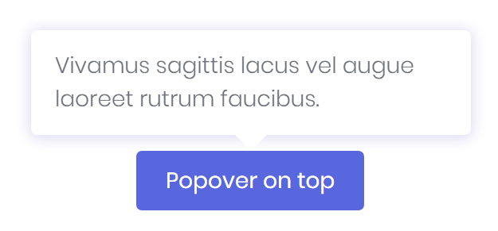
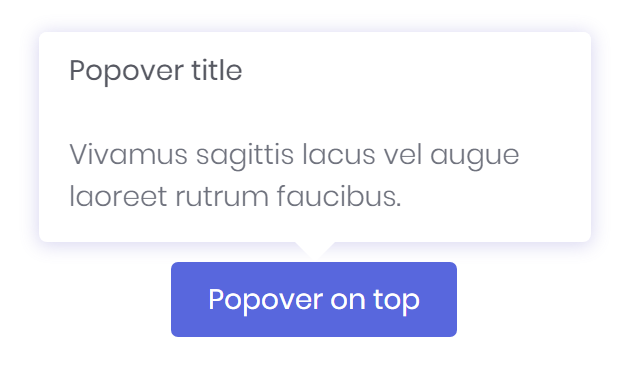
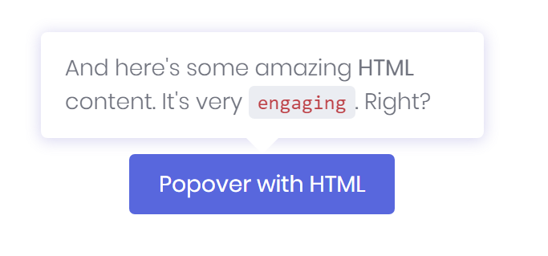

# Popover

A Popover is a component to show additional informations for an element like those found in iOS. With the Mecons Tag Helper it is possible to add those informations to any element on your app.



```markup
<button type="button" bc-popover="Vivamus sagittis lacus vel augue laoreet rutrum faucibus.">
    Popover on top
</button>
```

---

## Configuration

### Content (Mandatory) (Trigger Attribute)

The `bc-popover` attribute is available on each HTML element and specifies the popover content. After these attribute is set for an element further attributes are available to concretize the popover definition.

```markup
<button type="button" bc-popover="Text and content">Button with Popover</button>
```

### Title

You can set a title for the popover with the `bc-popover-title` attribute.



```markup
<button type="button" bc-popover="..." bc-popover-title="Popover title">
    Popover on top
</button>
```

### Dismissible

Use the `bc-popover-dismissible` attribute and set a focus trigger to dismiss popovers on the next click that user makes.

### Delay

Define a delay for showing and hiding the popover with `bc-popover-delay` attribute. The value of these attribute are milliseconds.

```markup
<button type="button" bc-popover="Text and content" bc-popover-delay="1000">Button with Popover</button>
```

### Placement

With the `bc-popover-placement` can specified how to position a popover. Possible values are `Top` (default), `Bottom`, `Left` or `Right`.

### HTML

Set the `bc-popover-html` attribute to `true` to allow HTML tags within the popover content.



```markup
<button type="button" bc-popover="And here's some amazing <b>HTML</b> content. It's very <code>engaging</code>. Right?" bc-popover-html="true">
    Popover with HTML
</button>
```