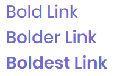
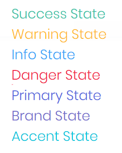

# Anchor

The anchor element or rather the `<a>` tag defines a hyperlink, which is used to link from one page to another.


```markup
<a href="#" bc-link="true">Basic Link</a>
```

---

## Configuration

### Link (Mandatory) (Trigger Attribute)

The `bc-link` attribute is available on each HTML `<a>` tag and activate the Metronic link rendering by setting it to `true`.

### Uppercase

Transform all characters of the anchor to uppercase by setting the `bc-uppercase` attribute to `true`.


```markup
<a href="#" bc-link="true" bc-uppercase="true">Uppercase Link</a>
```

### Weight

The `bc-weight` attribute sets how thick or thin characters in anchor should be displayed. Available weights are `Bold`, `Bolder` or `Boldest`.



```markup
<a href="#" bc-link="true" bc-weight="Bold">Bold Link</a>
<a href="#" bc-link="true" bc-weight="Bolder">Bolder Link</a>
<a href="#" bc-link="true" bc-weight="Boldest">Boldest Link</a>
```

### Color

Use the `bc-color` attribute to define a color for the anchor.



```markup
<a href="#" bc-link="true" bc-color="Success">Success State</a>
<a href="#" bc-link="true" bc-color="Warning">Warning State</a>
<a href="#" bc-link="true" bc-color="Info">Info State</a>
<a href="#" bc-link="true" bc-color="Danger">Danger State</a>
<a href="#" bc-link="true" bc-color="Primary">Primary State</a>
<a href="#" bc-link="true" bc-color="Brand">Brand State</a>
<a href="#" bc-link="true" bc-color="Accent">Accent State</a>
```