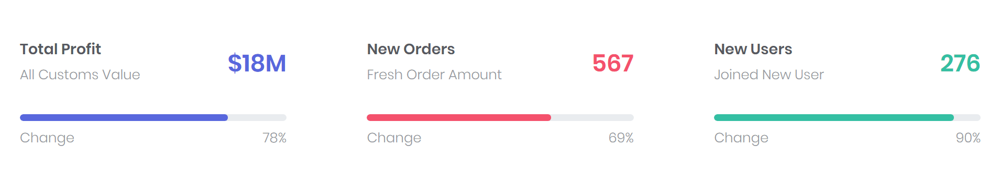
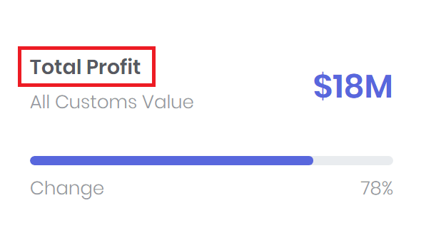
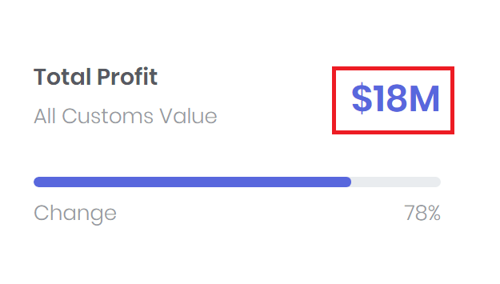
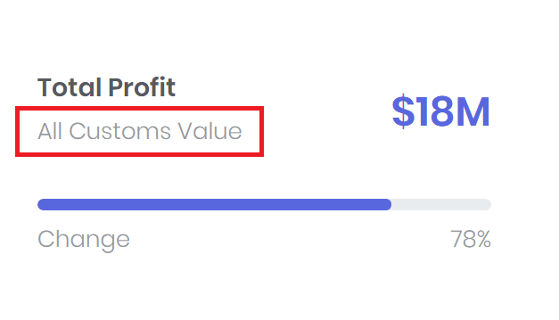
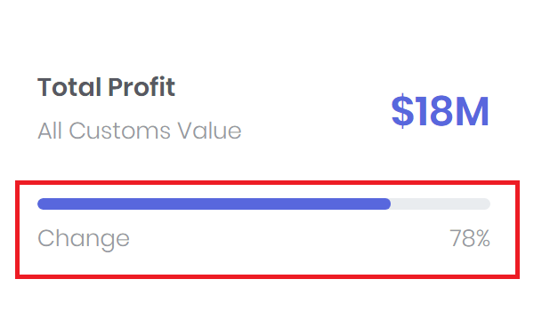

# Progress Widget

The Mecons Progress Widget is used to display KPIs (Key Performance Indicator). Not only the KPI can be displayed in the widget, but also the degree of fulfillment can be visualized via a progress.



```markup
<widget-progress bc-title="Total Profit" bc-desc="All Customs Value" bc-value="$18M" bc-progress="78" bc-progress-desc="Change" bc-color="Primary" />
```

---

## Configuration

### Title (Mandatory)

With the `bc-title` attribute the title of the widget can be defined. This attribute is a mandatory attribute and must be defined.



### Value (Mandatory)

The `bc-value` attribute defines the KPI. This is a free text (not a number etc.) that can be defined as desired. This attribute is a mandatory attribute and must be defined.



### Description

A description for the KPI can be added with the `bc-desc` attribute.



### Progress

To show how many percent of the KPI have already been reached, a progress can be added to the widget. For this only the `bc-progress` attribute has to be set.

In addition, a further description of this progress can be displayed with the `bc-progress-desc` attribute.



### Color

Adjust the color of the KPI and the progress with the `bc-color` attribute. The default color is `Primary`.