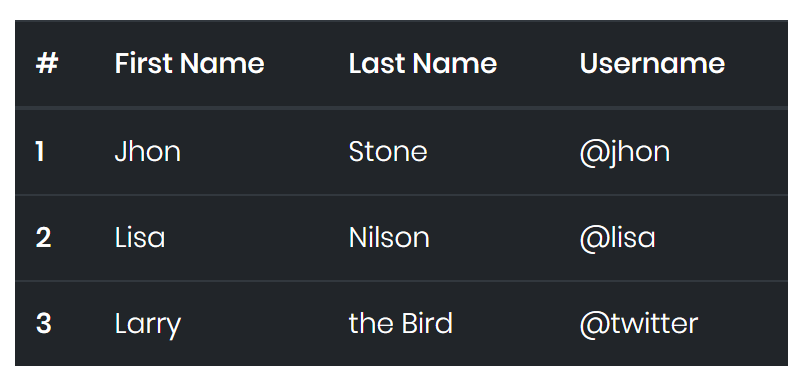
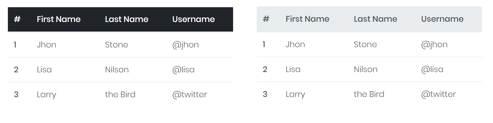
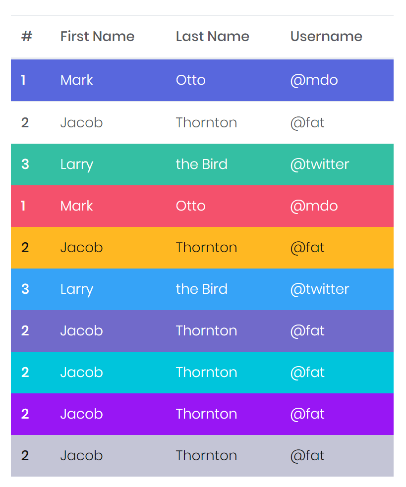

# Table

Opt-in and styling of Tables with the easy-to-use Mecons Tag Helpers.


```markup
<table>
    <thead>
        <tr>
            <th>#</th>
            <th>First Name</th>
            <th>Last Name</th>
            <th>Username</th>
        </tr>
    </thead>
    <tbody>
        <tr>
            <th scope="row">1</th>
            <td>Jhon</td>
            <td>Stone</td>
            <td>@jhon</td>
        </tr>
        <tr>
            <th scope="row">2</th>
            <td>Lisa</td>
            <td>Nilson</td>
            <td>@lisa</td>
        </tr>
        <tr>
            <th scope="row">3</th>
            <td>Larry</td>
            <td>the Bird</td>
            <td>@twitter</td>
        </tr>
    </tbody>
</table>
```

---

## Configuration

### Theme

To change the theme of a table - with white, light or dark background - use the `bc-theme` attribute. Possible themes are `Default` (default), `Light` and `Dark`.



```markup
<table bc-theme="Dark">
    ...
</table>
```

### Striped

Use the `bc-striped` attribute to add zebra-striping to any table row.


```markup
<table bc-striped="true">
    ...
</table>
```

### Small

Add the `bc-small` attribute to make tables more compact by cutting cell padding in half.


```markup
<table bc-small="true">
    ...
</table>
```

### Border

Add the `bc-border` attribute to specify the borders on all sides of the table and cells. Possible border styles are `Regular`(default) for only horizontal borders, `Bordered` for horizontal and vertical borders and `Borderless` for no borders.


```markup
<table>
    ...
</table>
<table bc-border="Bordered">
    ...
</table>
<table bc-border="Borderless">
    ...
</table>
```

### Responsive

Create responsive tables by adding the `bc-responsive` attribute to make them scroll horizontally on small devices. When viewing on anything larger than 768px wide, you will not see any difference in these tables.

```markup
<table bc-responsive="true">
    ...
</table>
```

### Hover

Add the `bc-hover` attribute to enable a hover state on table rows.

```markup
<table bc-hover="true">
    ...
</table>
```

---

### Head Configuration

### Theme

Similar to themed tables, use the `bc-theme` attribute to make `<thead>` appear `Default` (default), `Dark` or `Light`.



```markup
<table>
    <thead bc-theme="Dark">
        ...
    </thead>
    <tbody>
        ...
    </tbody>
</table>

<table>
    <thead bc-theme="Light">
        ...
    </thead>
    <tbody>
        ...
    </tbody>
</table>
```

---

## Row Configuration

### Background

Use the `bc-background` attribute to color table rows.



```markup
<table>
    <thead>
        ...
    </thead>
    <tbody>
        <tr bc-background="Primary"> ... </tr>
        <tr bc-background="Secondary"> ... </tr>
        <tr bc-background="Success"> ... </tr>
        <tr bc-background="Danger"> ... </tr>
        <tr bc-background="Warning"> ... </tr>
        <tr bc-background="Info"> ... </tr>
        <tr bc-background="Brand"> ... </tr>
        <tr bc-background="Accent"> ... </tr>
        <tr bc-background="Focus"> ... </tr>
        <tr bc-background="Metal"> ... </tr>
    </tbody>
</table>
```