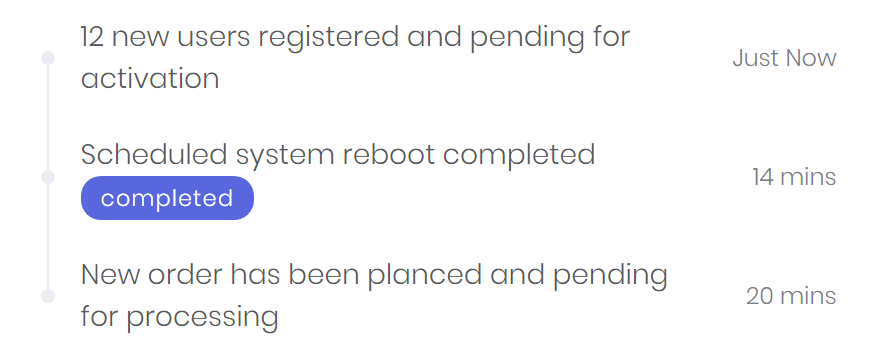
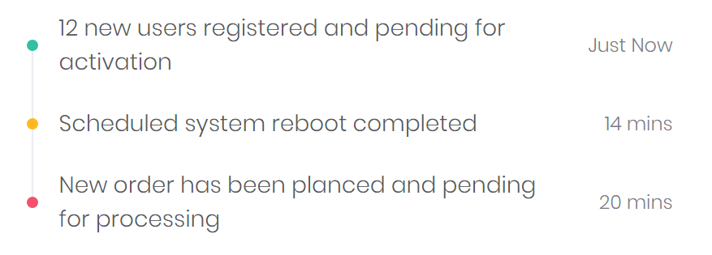
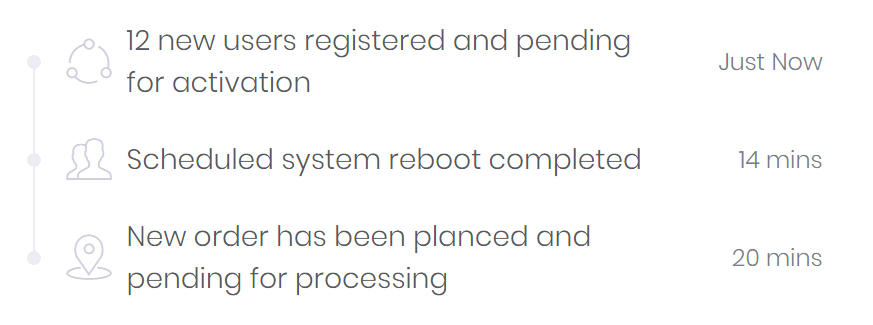

# Timeline

A Timeline is a structured representation of events and their chronologically occurance.



```markup
<timeline>
    <timeline-item bc-time="Just Now">
        12 new users registered and pending for activation
    </timeline-item>
    <timeline-item bc-time="14 mins">
        Scheduled system reboot completed
        <badge bc-wide="true">completed</badge>
    </timeline-item>
    <timeline-item bc-time="20 mins">
        New order has been planced and pending for processing
    </timeline-item>
</timeline>
```

---

## Item Configuration

### Time (Mandatory)

Set a timestamp for the timeline item with the `bc-time` attribute.

### Color

A color for the timeline item can be set with the `bc-color` attribute.



```markup
<timeline>
    <timeline-item bc-color="Success" bc-time="Just Now"> ... </timeline-item>
    <timeline-item bc-color="Warning" bc-time="14 mins"> ... </timeline-item>
    <timeline-item bc-color="Danger" bc-time="20 mins"> ... </timeline-item>
</timeline>
```

### Icon

Set an icon for the timeline item with the `bc-icon` attribute.



```markup
<timeline>
    <timeline-item bc-time="Just Now" bc-icon="FI_Share"> ... </timeline-item>
    <timeline-item bc-time="14 mins" bc-icon="FI_Users"> ... </timeline-item>
    <timeline-item bc-time="20 mins" bc-icon="FI_Placeholder"> ... </timeline-item>
</timeline>
```