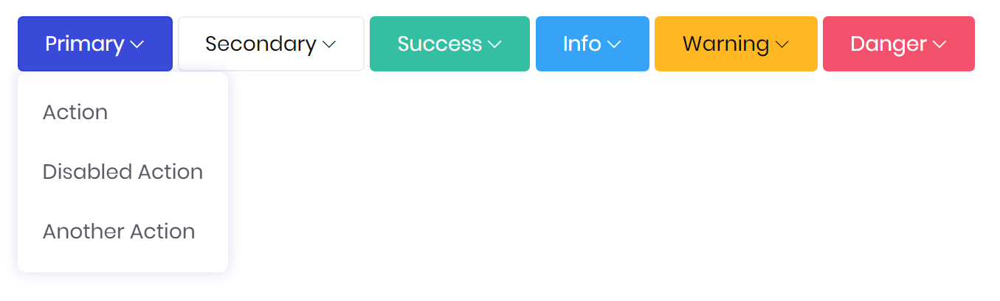
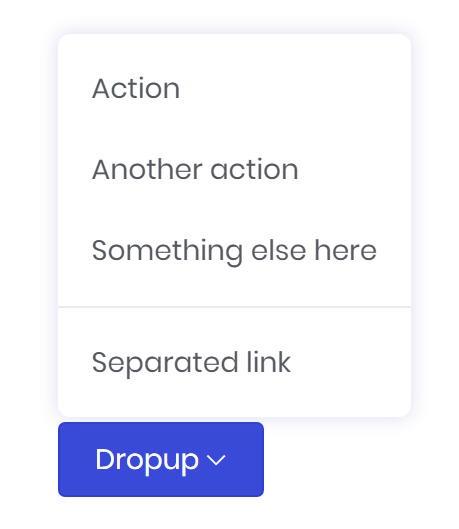
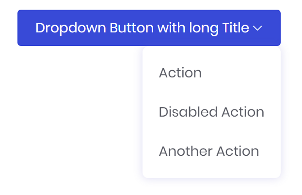
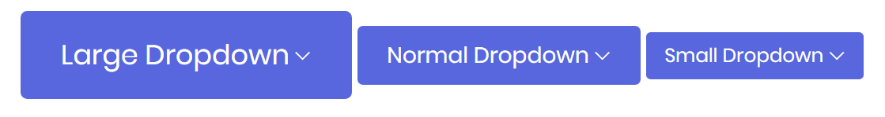
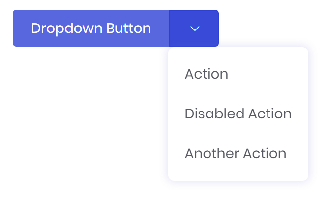

# Dropdown Button

Dropdown Buttons are contextual overlays for displaying lists of links and more.



```markup
<button-dropdown bc-title="Primary">
	<a href="#">Action</a>
	<a href="#" bc-disabled="true">Disabled Action</a>
	<a href="#">Another Action</a>
</button-dropdown>
<button-dropdown bc-title="Secondary" bc-color="Secondary">
	...
</button-dropdown>
```

---

## Components

Components are tag helpers that are available within a `<button-dropdown>`.

### Menu Item

The `<a>` tag represents an item within the dropdown menu. These regular HTML link tag is extended by a Mecons tag helper which provides further attributes.

### Divider

The `<divider>` tag helper helps you to seperate groups of related menu items.

### Header

With the `<header>` tag helper it is possible to add a header to label sections of actions in any dropdown menu.

---

## Configuration

### Title (Mandatory)

The `bc-title` attribute specifies a title for the button that triggers the dropdown menu.

### Dropup

Set the `bc-dropup` attribute to trigger the dropdown menu above the button.



```markup
<button-dropdown bc-title="Dropup" bc-dropup="true">
	...
</button-dropdown>
```

### Color

Use the `bc-color` attribute to modify the styling of the dropdown button. Possible styles are `Primary` (default), `Secondary`, `Success`, `Danger`, `Warning`, `Info`, `Light` or `Dark`.



```markup
<button-dropdown bc-title="Dropdown Button with long Title" bc-alignment-right="true">
	...
</button-dropdown>
```

### Size

Add the `bc-size` attribute to define a size for the dropdown button. Possible sizes are `Default`, `Large` or `Small`.



```markup
<button-dropdown bc-title="Large Dropdown" bc-size="Large">
	...
</button-dropdown>

<button-dropdown bc-title="Normal Dropdown">
	...
</button-dropdown>

<button-dropdown bc-title="Small Dropdown" bc-size="Small">
	...
</button-dropdown>
```

### Split

The `bc-split` attribute seperates the dropdown menu trigger from the rest of the button. This make it possible to allocate an seperate action to the button.



```markup
<button-dropdown bc-title="Dropdown Button" bc-split="true">
	...
</button-dropdown>
```

---

## Menu Item Configuration

### Disable

Add the `bc-disable` attribute to disable an menu item in the dropdown.