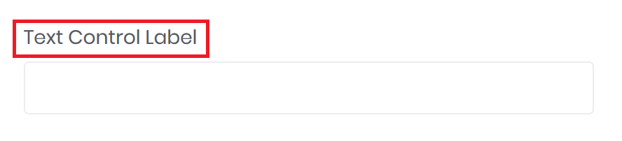
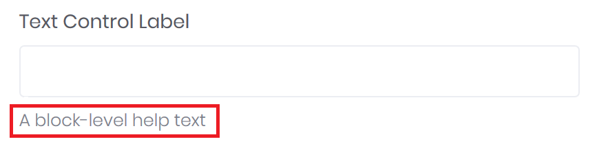

# Label &amp; Help

With a label or a help text it is possible to desribe a control in more detail.

---

## Label

A label shows a name for a control and can be defined with the `<label>` tag within a `<form-group>`.



```markup
<form-group>
	<label for="input1">Text Control Label</label>
	<input id="input1" type="text" />
</form-group>
```

### Screenreader

Set the `bc-sronly` attribute to hide the label on all devices except screen readers.

---

## Help

A block-level help text for form controls can be created with the `<help>` tag helper within the `<form-group>`.



```markup
<form-group>
	<input type="text" bc-label="Text Control Label" />
	<help>A block-level help text</help>
</form-group>
```