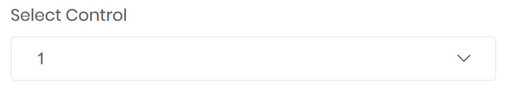

# Dropdown (Select)

A dropdown will be specified with a `<select>` tag and provides a dropdown to select a single or multiple values.



```markup
<select bc-label="Select Control">
	<option>1</option>
	<option>2</option>
	<option>3</option>
</select>
```