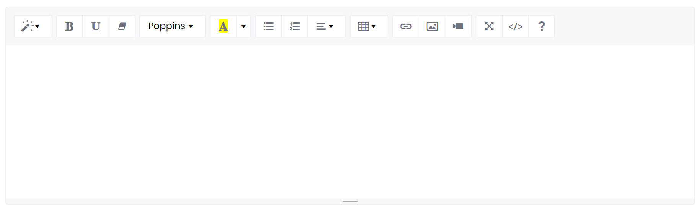

# Summernote

Summernote is a super simple WYSIWYG editor on Bootstrap. You design your content as it should look like later, Summernote translate this to valid HTML markup.



```markup
<summernote bc-height="200" />
```

---

## Configuration

### Height

Set the editor height with the `bc-height` attribute. Allowed values for this attribute are integers. The unit for this value are pixels (px).