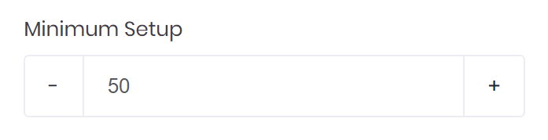
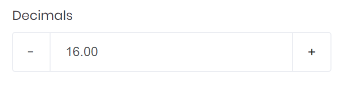
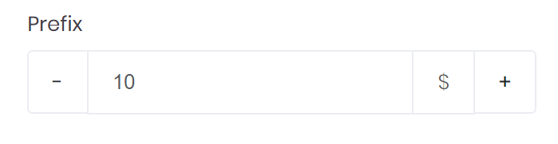
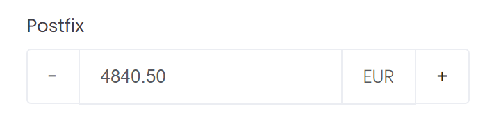
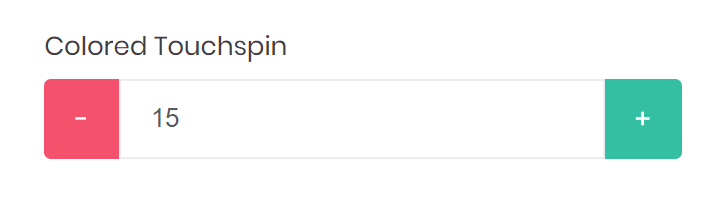

# Touchspin

A Touchspin is a mobile and touch friendly spinner component for numeric inputs. It supports the mousewheel and the up/down keys.



```markup
<touchspin bc-label="Minimum Setup" />
```

---

## Configuration

### Minimum

Define the minimum value of the touchspin with the `bc-min` attribute. By default the minimum value is `0`.

### Maximum

Define the maximum value of the touchspin with the `bc-max` attribute. By default the maximum value is `100`.

### Step

Set the incremental/decremental step on up/down change with the `bc-step` attribute. By default the step is `1`.

### Decimals

Set the number of decimal points with the `bc-decimals` attribute. By default the number of decimals are `0`.



```markup
<touchspin bc-label="Decimals" bc-decimals="2" />
```

### Prefix

Define a text or character before the input of the touchspin by using the `bc-prefix` attribute.



```markup
<touchspin bc-label="Prefix" bc-postfix="$" />
```

### Postfix

Define a text or character after the input of the touchspin by using the `bc-postfix` attribute.



```markup
<touchspin bc-label="Postfix" bc-max="10000" bc-decimals="2" bc-step="0.5" bc-postfix="EUR" />
```

### Colored Buttons

Define the color of the down button with the `bc-color-down` attribute. Use the `bc-color-up`attribute to define a color for up button. By default, the color for both buttons are `Secondary`.



```markup
<touchspin bc-label="Colored Touchspin" bc-color-down="Danger" bc-color-up="Success" />
```

### Up Button Color

Define the color of the up button with the `up-color` attribute.

### Orientation

The `bc-orientation` attribute can affect the orientation of the touchpin buttons. Possible values are a `Horizontal` (default) or a `Vertical` orientation.


```markup
<!-- Vertical Layout -->
<touchspin bc-label="Vertical" bc-orientation="Vertical" />

<!-- Horizontal Layout -->
<touchspin bc-label="Horizontal" bc-orientation="Horizontal" />
```