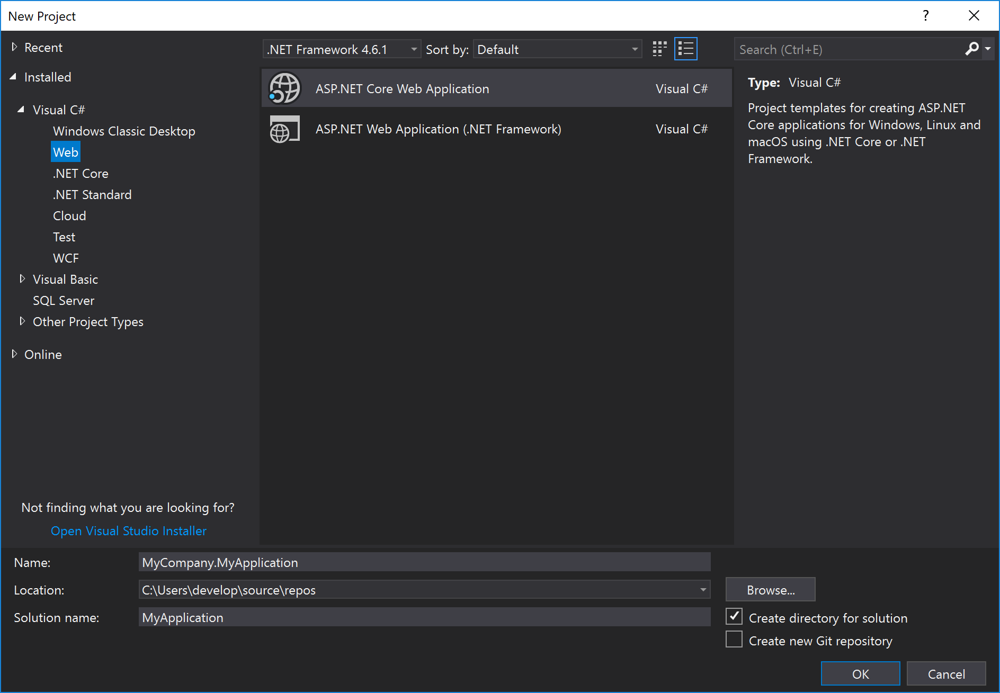

# Installation

On this page you will learn how to install Mecons Tag Helper Library into an ASP.NET Core Web Application together with the Metronic Admin Theme.

---

## Create new Web Application

The first step is to create a new project in Visual Studio. Choose the ***Web*** rubric and subsequent the ***ASP.NET Core Web Application*** template. Adapt the project parameters like ***Name***, ***Location*** and ***Solution name*** and click ***OK***.



In the following dialog choose the ***.NET Core*** Framework and the ***ASP.NET Core 2.x*** version as well as a project template. Optionally change the authentication and click ***OK***.


---

## Add Service Configuration

To ensure that Mecons runs correctly it is necessary to adapt the `Startup.cs`. Register inside the `ConfigureServices` method a singleton for the `IActionContextAccessor` and `IHttpContextAccessor`. Finally import the namespace `Microsoft.AspNetCore.Mvc.Infrastructure`.

```csharp hl_lines="1 9 10"
using Microsoft.AspNetCore.Mvc.Infrastructure

...

public void ConfigureServices(IServiceCollection services)
{
    services.AddMvc();

    services.AddSingleton<IHttpContextAccessor, HttpContextAccessor>();
    services.AddSingleton<IActionContextAccessor, ActionContextAccessor>();
}
```

!!!Warning
    If the services are not registered, an `InvalidOperationException` may occur on application runtime.

---

## Metronic Integration

In this section the Metronic Admin Theme will be integrated into an ASP.NET Core Web Application.

### Include Metronic Files

Copy the `assets` folder of your choosen Metronic Admin Theme (e.g. `/metronic_v5.x/dist/<YOUR FAVORITE THEME>/assets`) into the `wwwroot` folder of your project and rename it to `metronic`:

``` hl_lines="6 7 8 9 10"
MyCompany.MyApplication
├── wwwroot/
    ├── css/
    ├── js/
    ├── lib/
    ├── metronic/
        ├── app/
        ├── demo/
        ├── snippets/
        ├── vendors/
├── Controllers/
├── Models/
└── Views/
```

Copy the content of your choosen Metronic Admin Theme (e.g. `/metronic_v5.x/dist//index.html`) into the `Views/Shared/_Layout.cshtml`. Afterwards press **CTRL + H** to open the Quick Replace Tool and replace `assets/` with `~/metronic/`.

Include the `@RenderBody()` method at the position where the individual page content will be rendered.


To ensure that all Mecons Tag Helpers work as expected, it is necessary to move all JavaScript includes from the page bottom into the `<head>`.


---

## Mecons Installation

Open the Package Manager Console in Visual Studio and install the Mecons package:

```
PM> Install-Package BSolutions.Mecons -Source C:\Downloads\<UNZIPPED MECONS FOLDER>\
```

!!!Warning
    Not every Mecons package is compatible with every Metronic version. For further information check the description of the selected package or the change log.

After the package installation open `/Views/_ViewImports.cshtml` and insert the marked lines:

``` csharp hl_lines="3 4 6"
@using MyCompany.MyApplication
@using MyCompany.MyApplication.Models
@using BSolutions.Mecons.Enumerations
@using BSolutions.Brecons.Core.Enumerations
@addTagHelper *, Microsoft.AspNetCore.Mvc.TagHelpers
@addTagHelper *, BSolutions.Mecons
```

---

## Mecons Licensing

### License File

Create a directory named `Mecons` within the project root. Copy the license file (e.g. `mecons-x-x-x.lic`) into this new directory:

``` hl_lines="12 13"
MyCompany.MyApplication
├── wwwroot/
    ├── css/
    ├── js/
    ├── lib/
    ├── metronic/
        ├── app/
        ├── demo/
        ├── snippets/
        ├── vendors/
├── Controllers/
├── Mecons/
    ├── mecons-x-x-x.lic
├── Models/
└── Views/
```

Right click on the license file and choose Properties. Select **Copy always** in the **Copy to Output Directory** menu:


### License Key

The Mecons License Key can be set in the `Startup.cs` within the `ConfigureServices` method:

``` csharp hl_lines="12"
using BSolutions.Mecons

...

public void ConfigureServices(IServiceCollection services)
{
    services.AddMvc();

    services.AddSingleton<IHttpContextAccessor, HttpContextAccessor>();

    // Mecons License
    MeconsInfo.SetLicense("XXXXX-XXXXX-XXXXX-XXXXX-XXXXX");
}
```

## Mecons Rendering

By default, the Mecons Tag Helper Rendering is enabled for each HTML element. To disable the Brecons Tag Helper Rendering for a specific HTML element, set the `disable-brecons` attribute. The `disable-brecons` attribute is minimizable and needs no value.


```markup hl_lines="5"
<!-- Brecons Rendering -->
<button type="button">Brecons Button</button>

<!-- Default HTML Rendering -->
<button type="button" disable-brecons>HTML Button</button>
```