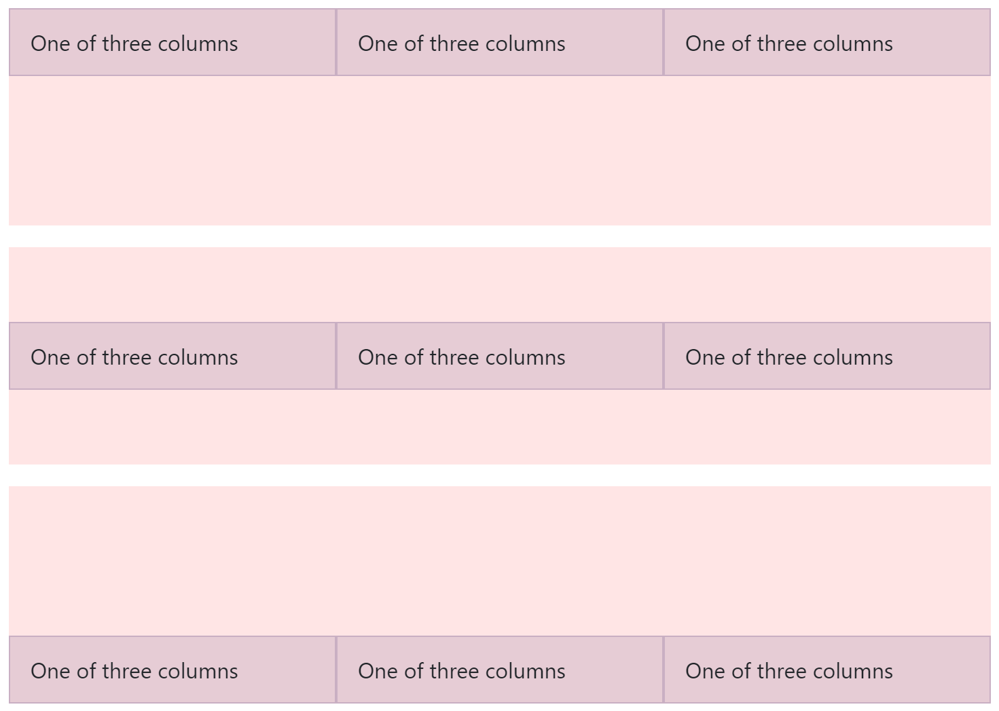
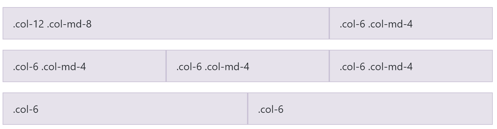
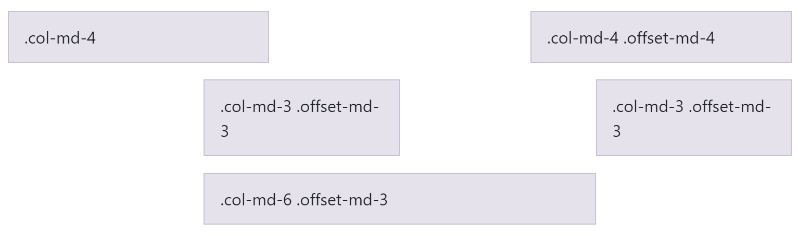

# Grid System

Use the powerful mobile-first flexbox [Bootstrap Grid System](https://getbootstrap.com/docs/4.0/layout/grid/) to build layouts of all shapes and sizes thanks to a twelve column system, five default responsive tiers, Sass variables and mixins, and dozens of predefined classes.

Bootstrap’s grid system uses a series of containers, rows, and columns to layout and align content. It’s built with flexbox and is fully responsive. All Bootstrap Grid System features are covered from the Mecons Tag Helper!


```markup
<row>
	<column>1 of 2</column>
	<column>2 of 2</column>
</row>
<row>
	<column>1 of 3</column>
	<column>2 of 3</column>
	<column>3 of 3</column>
</row>
```

---

## Row Configuration

### Vertical Alignment

To align all columns in a vertical direction set the `vertical-alignment` attribute. Possible values for the alignment are `Top`, `Middle` and `Bottom`.



```markup
<row vertical-alignment="Top" style="height: 10rem;">
    <column>One of three columns</column>
    <column>One of three columns</column>
    <column>One of three columns</column>
</row>
<row vertical-alignment="Middle" style="height: 10rem;">
    <column>One of three columns</column>
    <column>One of three columns</column>
    <column>One of three columns</column>
</row>
<row vertical-alignment="Bottom" style="height: 10rem;">
    <column>One of three columns</column> 
    <column>One of three columns</column>
    <column>One of three columns</column>
</row>
```

### Horizontal Alignment

To align all columns in the horizontal direction set the `alignment` attribute. Possible values for the classic horizontal alignment are `Left`, `Center` and `Right`. Choose the value `Around` for the same width whitespace before, between and after the aligned columns. The value `Between` renders a full width whitespace between the columns.


```markup
<row alignment="Left">
    <column xs-size="4">One of two columns</column>
    <column xs-size="4">One of two columns</column>
</row>
<row alignment="Center" style="margin-top: 1rem;">
    <column xs-size="4">One of two columns</column>
    <column xs-size="4">One of two columns</column>
</row>
<row alignment="Right" style="margin-top: 1rem;">
    <column xs-size="4">One of two columns</column>
    <column xs-size="4">One of two columns</column>
</row>
<row alignment="Around" style="margin-top: 1rem;">
    <column xs-size="4">One of two columns</column>
    <column xs-size="4">One of two columns</column>
</row>
<row alignment="Between" style="margin-top: 1rem;">
    <column xs-size="4">One of two columns</column>
    <column xs-size="4">One of two columns</column>
</row>
```

---

## Column Configuration

### Size

Set the column width for a specified resolution with the appropriate attribute (e.g. `xs-size`, `sm-size`, `md-size`, `lg-size` or `xl-size`). If you don't set any size attribute each column renders with equal width and is auto-layouted.



```markup
<row>
    <column xs-size="12" md-size="8">.col-12 .col-md-8</column>
    <column xs-size="6" md-size="4">.col-6 .col-md-4</column>
</row>

<!-- Columns start at 50% wide on mobile and bump up to 33.3% wide on desktop -->
<row>
    <column xs-size="6" md-size="4">.col-6 .col-md-4</column>
    <column xs-size="6" md-size="4">.col-6 .col-md-4</column>
    <column xs-size="6" md-size="4">.col-6 .col-md-4</column>
</row>

<!-- Columns are always 50% wide, on mobile and desktop -->
<row>
    <column>.col-6</column>
    <column>.col-6</column>
</row>
```

### Render

To size columns based on the natural width of their content, use the appropriate attribute (e.g. `xs-render`, `sm-render`, `md-render`, `lg-render` or `xl-render`).


```markup
<row alignment="Center">
    <column>1 of 3</column>
    <column md-render="Dynamic">Variable width content</column>
    <column>2 of 3</column>
</row>
<row>
    <column>1 of 3</column>
    <column xl-render="Dynamic">
        Variable width content Variable width content
        Variable width content Variable width content
        </column>
    <column>3 of 3</column>
</row>
```

### Order

Use the order attribute for controlling the visual order of your content. These attributes are responsive, so you can set the order by a specific resolution (e.g. `xs-order`, `sm-order`, `md-order`, `lg-order` or `xl-order`). Includes support for 1 through 12 across all five grid tiers.


```markup
<row>
    <column>First, but unordered</column>
    <column xs-order="12">Second, but last</column>
    <column xs-order="1">Third, but first</column>
</row>
```

### Offset

Set the column offset for a specified resolution with the appropriate attribute (e.g. `xs-offset`, `sm-offset`, `md-offset`, `lg-offset` or `xl-offset`).



```markup
<row>
    <column md-size="4">.col-md-4</column>
    <column md-size="4" md-offset="4">.col-md-4 .offset-md-4</column>
</row>
<row>
    <column md-size="3" md-offset="3">.col-md-3 .offset-md-3</column>
    <column md-size="3" md-offset="3">.col-md-3 .offset-md-3</column>
</row>
<row>
    <column md-size="6" md-offset="3">.col-md-6 .offset-md-3</column>
</row>
```

### Vertical Alignment

To align a single column in the vertical direction within a row set the `vertical-alignment` attribute.


```markup
<row style="height: 10rem;">
    <column vertical-alignment="Top">One of three columns</column>
    <column vertical-alignment="Middle">One of three columns</column>
    <column vertical-alignment="Bottom">One of three columns</column>
</row>
```